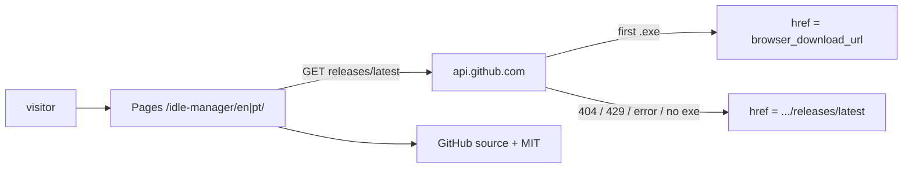

# Idle manager public home — Technical Specification

## Context

- **PRD:** `.spec-finder/tasks/product-website/_prd.md`
- The Electron repo has no public HTML seam. V1 adds a **static Astro app at `site/`**, published to project GitHub Pages, with locale-prefixed routes and a browser GitHub Releases probe for Download (ADR-003, ADR-004).
- **PRD tension (user-resolved):** G-03 asked to withhold Download when no installer exists. The user chose an always-visible Download: asset URL if the API finds a `.exe`, else `.../releases/latest` (including 404). G-03 here means “never a dead file on our origin,” not “button hidden.”
- **Closed:** `/idle-manager/` redirects to `/idle-manager/en/`. Repo gets an MIT `LICENSE` so GitHub metadata matches the page. Picker uses the first allowlisted `.exe`.

### Evidence

| Kind | Finding/constraint | Source | Version/date | Design consequence |
|---|---|---|---|---|
| Repository | Electron-only tree; Vitest is `src/shared/**/*.test.ts` | `AGENTS.md`, `vitest.config.ts` | 2026-08-30 | New `site/`; do not hitch to root `pnpm test` |
| Official docs | Pages project URL needs Astro `site` + `base` | [Astro GitHub Pages](https://docs.astro.build/en/guides/deploy/github/) | 2026-08-30 | `base: '/idle-manager'` |
| Official docs | Locale prefixes via `prefixDefaultLocale` | [Astro i18n](https://docs.astro.build/en/guides/internationalization/) | 2026-08-30 | `/en/`, `/pt/` |
| API | `/releases/latest` 404; CORS `*`; 60 req/h/IP | `GET api.github.com/.../releases/latest` | 2026-08-30 | Probe in browser; no token |
| User decision | Approach A + always fallback; `/` → `/en/`; MIT LICENSE; first `.exe` | ADR-003, ADR-004 + TechSpec follow-ups | 2026-08-30 | Locks URL, license, picker |
| Inference | `src/renderer` must not host this page | `AGENTS.md` isolation split | 2026-08-30 | Separate static origin |

## Technical Goals and Non-Goals

### Goals

- Static player document at project Pages, not inside Electron — G-01, F-01
- Identical PT/EN claims on `/pt/` and `/en/`; `/` redirects to `/en/` — G-01, F-08, US-06
- Download href from Releases probe (first `.exe` asset or `/releases/latest`) — G-02, F-04, F-06, US-03, US-04
- Unsigned/SmartScreen copy next to Download — F-05
- No analytics pixels; privacy names Pages IP logs **and** the GitHub API GET — G-04, F-07, US-05
- Keyboard-reachable controls; locale switch is links — G-05, F-09, US-07
- GitHub repo license MIT (LICENSE file) matching `package.json` — F-07
- Pure `selectWindowsDownload` tested without Electron — ADR-004

### Non-Goals

- Astro SSR or a Node host — Pages is static
- HeroUI/React on the site
- Changing root `pnpm test` / `verify:isolation`
- macOS/Linux asset picking
- Code signing, custom domain, extra routes (docs/changelog)
- GitHub token or authenticated API
- Restoring G-03 hidden-button without a new ADR
- `Accept-Language` negotiation (static Pages)

## Requirement Traceability

| PRD ID | Technical obligation | Component/interface | Verification | Status/gap |
|---|---|---|---|---|
| G-01 | Locale landings render isolation-vs-bot in first content | `site/src/pages/[locale]/index.astro` | Checklist; copy fixtures | Design |
| G-02 | Asset href when first `.exe` present | `selectWindowsDownload` | Unit fixture with `.exe` | Design |
| G-03 | Relaxed: empty → GitHub Releases page, not hidden control | `selectWindowsDownload` fallback | Unit 404 | **ADR-004 vs PRD hide-button** |
| G-04 | No extra pixels; disclose API GET | HTML + privacy copy | Source/network | Design |
| G-05 | Keyboard path via links + Download | HTML | Keyboard pass | Design |
| US-01 | Isolation copy both locales | Page content | Copy review | Design |
| US-02 | Empty installer: Download present, fallback href | Probe | Unit 404 | Design |
| US-03 | Download starts asset when present | `href=browser_download_url` | Unit + manual | Design |
| US-04 | No `.dmg`/AppImage buttons; source link always | Picker `.exe` only | Unit | Design |
| US-05 | Privacy: app vs host IP vs GitHub API | Privacy section | Copy review | Design |
| US-06 | `/en/` and `/pt/` | Astro i18n | Build paths | Design |
| US-07 | Keyboard + img text | Semantic HTML | Keyboard pass | Design |
| F-01–F-09 | As above | `site/` | As above | Design |
| Constraints | No bot/proxy claims; README stays; Windows-only installer; MIT | Copy, picker, LICENSE | Review | Design |

## Decision

**Astro `site/` on project Pages**, `/en/` + `/pt/` with `/` → `/en/`, **runtime Releases probe**, always-visible Download (first `.exe` or GitHub latest page), **MIT LICENSE** on the repo. Primary trade-off: browser talks to `api.github.com`; empty repo still shows Download to GitHub Releases. Gives up: build-time withhold.

### Alternatives rejected

- Build-time `WINDOWS_DOWNLOAD_URL`; plain `docs/` HTML; fail-closed hide Download; `/` → `/pt/`; `Accept-Language`; name-heuristic picker

## Architecture



### Components

| Component | Existing/new | Responsibility | Inputs/outputs | Dependencies |
|---|---|---|---|---|
| `site/` Astro app | new | Static PT/EN landing | `/idle-manager/en|pt/` | Astro, pnpm |
| `selectWindowsDownload` | new | JSON → href | `ProbeResult` | none |
| Download script | new | Fetch + set Download href | GET latest | GitHub REST |
| `LICENSE` | new if missing | GitHub license MIT | repo metadata | MIT text |
| Pages workflow | new | Build and deploy `site/` | `main` | `withastro/action` |
| Electron app | existing | Unchanged | — | Must not import `site/` |

### Impact

| Component/file | Impact | Risk | Required action |
|---|---|---|---|
| `site/**` | new | `base` mistakes | Prefix internal links |
| `.github/workflows/*` | new | Pages permissions | `pages: write`, `id-token: write` |
| `LICENSE` | add | Drift from package.json | MIT only |
| Root Vitest | none | Accidental include | Keep shared-only |
| `src/main`, partitions | none | Isolation | Do not touch |

## Contracts

### Public URLs

```
origin:  https://matheusbarni.github.io
base:    /idle-manager/
en:      /idle-manager/en/
pt:      /idle-manager/pt/
root:    /idle-manager/ → redirect → /idle-manager/en/
source:  https://github.com/MatheusBBarni/idle-manager
fallbackDownload: https://github.com/MatheusBBarni/idle-manager/releases/latest
api:     https://api.github.com/repos/MatheusBBarni/idle-manager/releases/latest
```

### `selectWindowsDownload`

```ts
export type ProbeResult =
  | { kind: 'asset'; href: string; name: string }
  | { kind: 'fallback'; href: string }

export function selectWindowsDownload(
  input: { ok: boolean; status: number; json: unknown },
  fallbackHref: string
): ProbeResult
```

- If `ok` and `json.assets` is an array, pick the **first** asset whose `name` ends with `.exe` (case-insensitive) and whose `browser_download_url` is `https:` on `github.com`, `githubusercontent.com`, or `release-assets.githubusercontent.com`.
- Else `{ kind: 'fallback', href: fallbackHref }`.
- Never inject other JSON into the DOM.

### Download control

Always rendered. Default `href` = fallback, then probe may replace it. SmartScreen warning always visible. No macOS/Linux installer controls.

### Errors

| Name | Cause | User behavior |
|---|---|---|
| `ReleaseMissing` | 404 or no `.exe` | Fallback href |
| `ReleaseRateLimited` | 429 | Fallback href |
| `ReleaseUnreachable` | network / non-JSON | Fallback href |
| `AssetRejected` | non-https or wrong host | Fallback href |

## Failure and Edge Cases

| Failure mode | Detection | Behavior | Recovery | Evidence |
|---|---|---|---|---|
| No releases | 404 | Fallback Releases page | Publish `.exe` | Unit 404 |
| Only `.dmg` | picker | Fallback | Add NSIS | Unit |
| Several `.exe` | picker | First in API list | Tighten later | Unit order |
| 429 | status | Fallback, no retry loop | Wait | Unit 429 |
| XSS JSON | allowlist | Reject href | — | Unit |
| JS disabled | no fetch | Default fallback href | GitHub | HTML |
| Missing LICENSE | GitHub `license: null` | Provenance mismatch | Add MIT file | API check |

## Security, NFRs, and Operations

- Unauthenticated GET only; no token.
- Allowlist Download hrefs; untrusted JSON.
- Privacy copy: Pages IP logs **and** GET `api.github.com`. No pixels.
- Site origin: no `persist:` sessions, no Node.
- Rollout: Pages via Actions after green build; add `LICENSE` before calling F-07 done.
- Rollback: disable Pages / revert workflow; Electron unchanged.
- G-02 measured via GitHub Release download counts, not page analytics.

## Tests

- **Unit:** `selectWindowsDownload` — 404/empty/429 → fallback; first `.exe` wins; `.dmg` skipped; `javascript:` rejected.
- **Integration:** Astro build emits `/en/` and `/pt/` under `base`.
- **e2e:** not in V1.
- **Gates:** `pnpm --dir site test` ; `pnpm --dir site build` ; `pnpm test` and `pnpm verify:isolation` unchanged and green.

## Sequencing

1. Scaffold `site/` with `base` and `en`/`pt`; `/` → `/en/` — no dependencies.
2. MIT `LICENSE` at repo root if missing — no dependencies.
3. Copy (isolation, privacy including API GET, source, MIT, SmartScreen) — depends on 1.
4. `selectWindowsDownload` + unit tests — no page dependency.
5. Wire Download default fallback + probe — depends on 3 and 4.
6. Pages GitHub Action — depends on 1.
7. Enable Pages in repo settings — depends on 6.

## Open Questions

None that change the design. Tightening the `.exe` heuristic is deferred until a Release has multiple Windows files.

## Architecture Decision Records

- [ADR-001](adrs/adr-001.md) — Hybrid gated download (product)
- [ADR-002](adrs/adr-002.md) — Dual-state page, PT+EN (product)
- [ADR-003](adrs/adr-003.md) — Astro `site/` + locale prefixes on project Pages
- [ADR-004](adrs/adr-004.md) — Runtime Releases probe; fail-open to `/releases/latest`
