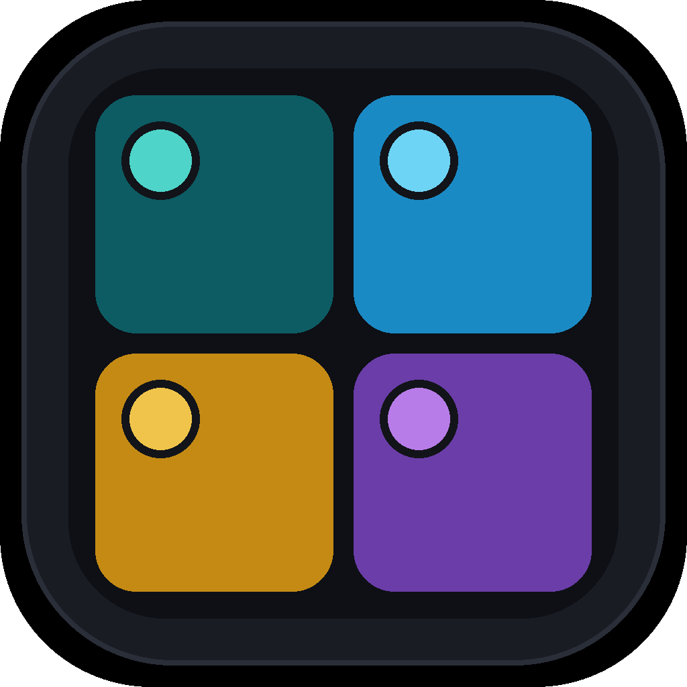

<div align="center">



# Idle manager

Desktop shell for many isolated idle-game accounts in one window.

[Features](#features) • [Getting started](#getting-started) • [Architecture](#how-it-is-put-together) • [Keyboard](#keyboard) • [Privacy](#privacy)

</div>

Idle manager is a small multi-session browser, not a bot.

A **tab** is one game URL.
An **account** is one isolated Chromium session inside that tab.
You can tile several logged-in users of the same origin, keep them alive in the background, and switch to another game without mixing cookies.

> [!IMPORTANT]
> A normal browser tab, iframe, or PWA cannot do this.
> Cookies, `localStorage`, IndexedDB, cache, and service workers are keyed by origin.
> Two live views of `https://gengar.com.br` in one profile share one jar.

## Features

- Isolated persistent sessions via `session.fromPartition('persist:opsource-account-{id}')`
- One `WebContentsView` per running account, tiled in the same window
- Tabs for any URL (not hardcoded games)
- Layouts: auto grid, single, columns, rows, free
- Per-account mute, zoom, reload, pop-out, and close (session stays on disk)
- Live CPU / RAM in the sidebar and status bar
- PT / EN and dark / light
- Import / export of workspace metadata (names and URLs, not cookie DBs)
- Optional encryption of workspace JSON with Electron `safeStorage`

## Prerequisites

- Node.js 20+
- [pnpm](https://pnpm.io/) 10+
- macOS, Windows, or Linux (Windows is the primary target)

On first `pnpm install`, allow build scripts for `electron` and `esbuild` (`pnpm approve-builds`).

## Getting started

```bash
pnpm install
pnpm dev
```

First launch:

1. Create a tab and set the game URL (for example `gengar.com.br`).
2. Add two accounts and start both.
3. Log into a different user in each panel.
4. Quit and reopen.
   Both sessions should still be logged in.

Closing a panel tears down the view and keeps the store.
Deleting an account wipes only that partition.
Closing a tab archives it.
Reopen from the history control next to **+**, or `Cmd/Ctrl+Shift+T`.

## Scripts

| Command | What it does |
| --- | --- |
| `pnpm dev` | Electron + Vite in development |
| `pnpm test` | Vitest (layout, workspace, partitions) |
| `pnpm typecheck` | `tsc` for main and renderer |
| `pnpm verify:isolation` | Prove two persist partitions do not share cookies or `localStorage` |
| `pnpm build` | Production bundle into `out/` |
| `pnpm pack` | Unpackaged app via electron-builder |
| `pnpm dist` | Installer (NSIS / dmg / AppImage) |

```bash
pnpm verify:isolation
```

The check writes distinct cookies for `https://gengar.com.br` and distinct `localStorage` values on a privileged local origin.
It exits `0` only if the two jars stay distinct.

## How it is put together

```
src/
  main/        window, WebContentsView, persist partitions, IPC
  preload/     contextBridge API
  renderer/    React chrome (HeroUI + Tailwind + Zustand)
  shared/      workspace reducer, layout math, i18n
```

The shell UI is React.
Game documents are native `WebContentsView`s placed into holes the renderer reports.
That split is required so each account has its own Chromium process and cookie jar.

| Need | Choice |
| --- | --- |
| Runtime | Electron 37 |
| Isolation | `persist:opsource-account-{accountId}` |
| Chrome UI | React 19, HeroUI v3, Tailwind v4 |
| Workspace state | Zustand mirroring a pure reducer in `src/shared/workspace.ts` |
| Remote data | None (no React Query). Metrics arrive over IPC |

Popups inherit the same session, so OAuth or Discord links do not leak into another account.
Hidden views keep `backgroundThrottling` off so idle loops stay alive.

> [!NOTE]
> Tauri and system webviews do not give the same partition model on every OS.
> Electron is the portable primitive for arbitrary Chrome-class game sites.

## Keyboard

Modifier is `Cmd` on macOS and `Ctrl` elsewhere.

| Shortcut | Action |
| --- | --- |
| `Mod+T` | New tab |
| `Mod+Shift+T` | Reopen last closed tab |
| `Mod+B` | Collapse / expand account sidebar |
| `Mod+L` | Focus URL bar |
| `Mod+R` | Reload active account |
| `Mod+Shift+R` | Reload all running accounts in the tab |
| `Mod+M` | Mute active account |
| `Mod+=` / `Mod+-` / `Mod+0` | Zoom in, out, reset |
| `Mod+Tab` | Next tab |
| `Mod+1…9` | Activate account in the current tab |

The URL bar navigates **only** the active account, not every panel in the tab.

## Privacy

Workspace metadata lives in the app user-data directory.
When OS encryption is available, that file is encrypted with `safeStorage`.
Chromium session directories stay on disk locally and are never sent to a server.
Passwords typed into a game stay in that account’s partition.

> [!WARNING]
> Idle manager does not automate gameplay, inject cheats, spoof fingerprints, or share one cookie jar as a “swap user” hack.

## Platform

Windows is the MVP target (NSIS via `pnpm dist`).
macOS and Linux use the same isolation primitive and are supported in development.
There is no mobile build.
